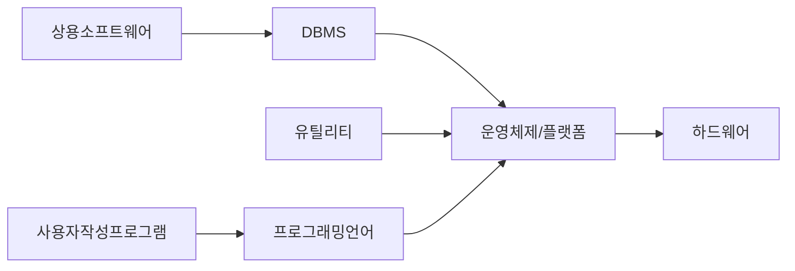
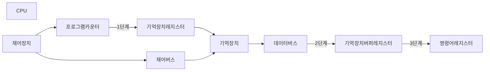

---

layout: post

title: "컴퓨터 아키텍쳐"

date: 2026-04-30 09:30:00 +0900

categories: blog study com_Archi

---

# Computer_Architechture
ch05 _ 하드웨어/0430

## 하드웨어

**레지스터**

 

CPU에 기본적으로 존재하는 레지스터의 종류와 기능 
- 프로그램 카운터(Pogram Counter, PC): 다음에 실행할 명령어의 주소를 저장한다.
- 명령어 레지스터(Instruction Register, IR):메모리에서 읽은 명령어를 수행하기 위해 일시적으로 저장한다.
- 기억 장치 주소 레지스터(Memory Address Register, MAR): 다음에 읽기/쓰기 동작을 수행할 기억 장소 의 주소를 저장하는 주소 저장용 레지스터이다.
- 기억 장치 버퍼 레지스터(Memory Buffer Register, MBR): 기억장치에 저장할 데이터나 기억장치에서 읽은 데이터를 임시로 저장한다.

## 소프트웨어
- 컴퓨터 시스템이나 주변 장치 등의 하드웨어를 작동하여 원하는 작업 결과를 얻기 위한 프로그램 또는 명령어의 거대 집합이다.

- 시스템 소프트웨어(System Software)
	- 컴퓨터 시스템을 운영하기 위한 프로그램, 컴퓨터 시스템의 개별 하드웨어 요소를 직접 제어ㆍ통합ㆍ관리하는 가장 중요한 기능을 수행한다.
	- 운영체제, 장치 드라이버, 프로그래밍 도구, 컴파일러, 어셈블러, 유틸리티 등이 포함

## 명령어 사이클

